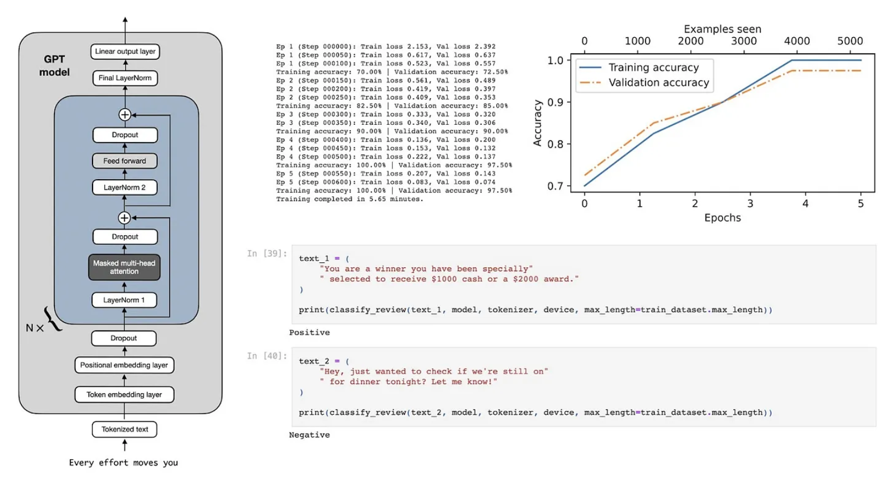
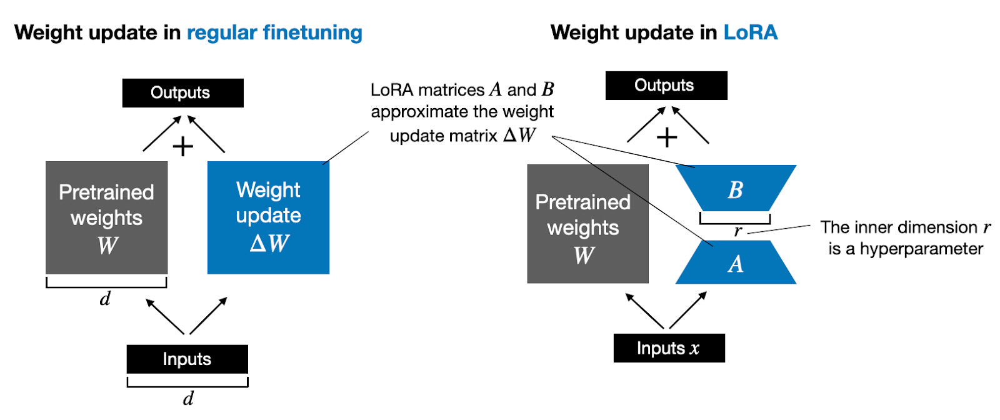
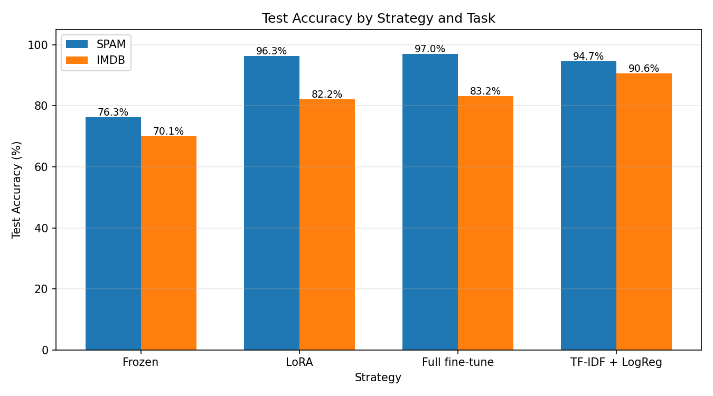
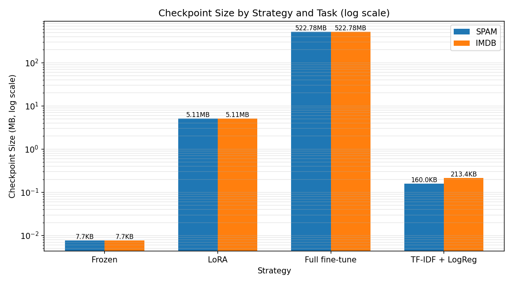

# GPT-2 From Scratch: Fine-Tuning Strategy Comparison

I built GPT-2 from the ground up, loaded in OpenAI's actual pretrained
weights, and then wrote LoRA from scratch to fine-tune it — no `peft`, no
shortcuts. Then I put it up against full fine-tuning, a frozen baseline, and
a plain TF-IDF classifier to see which one actually earns its complexity.

A GPT-2-style transformer written from scratch in PyTorch, loaded with OpenAI's
real pretrained weights, then fine-tuned three different ways — frozen head,
LoRA (implemented from scratch, not `peft`), and full fine-tune — and compared
against a TF-IDF baseline on two tasks: spam detection and IMDB sentiment.





## Results



| Strategy | Trainable params | Spam | IMDB | Checkpoint size |
|---|---|---|---|---|
| Frozen | 1,538 (0.001%) | 76.3% | 70.1% | ~8 KB |
| LoRA | 1.33M (1.06%) | 96.3% | 82.2% | 5.11 MB |
| Full fine-tune | 124M (100%) | 97.0% | 83.2% | 522.78 MB |
| TF-IDF + LogReg | 5,000 features | 94.7% | **90.6%** | 0.16–0.21 MB |



LoRA lands within a point of full fine-tuning on both tasks while training
about 1% of the parameters and producing a checkpoint roughly 100x smaller —
if you had to actually ship one of these, LoRA is the easy call.

TF-IDF beats every GPT-2-based method on IMDB. The fine-tuning pipeline
truncates each review to 128 tokens before it reaches the model; TF-IDF sees
the whole review. On a task where the deciding sentence can show up anywhere
in the text, that gap shows up directly in the numbers.

Frozen comes in last on both tasks. GPT-2's untouched last-token
representation carries some signal, but it's not a substitute for actually
adapting the model.

Confusion matrices and misclassified examples for all eight runs are
generated by `analysis/evaluate_results.py` and saved into `analysis/`.

## Project structure

```
shared/                  architecture, LoRA, weight loading, model factory
spam_classification/     data prep, fine-tuning scripts, results
imdb_finetuning/         same, for IMDB sentiment
analysis/                evaluation script + generated charts
notebooks/                Colab notebooks used to run everything
```

`shared/architecture.py` is the transformer itself. `shared/lora.py` is the
from-scratch LoRA implementation. `shared/instantiate_model.py` builds a
model either randomly initialized or loaded with real GPT-2 weights via
`shared/gpt2_downloader.py`.

## Running it

1. `notebooks/prepare_datasets.ipynb` downloads spam (UCI SMS Spam
   Collection) and IMDB, saves both to Drive.
2. Upload `architecture.py`, `lora.py`, `instantiate_model.py`, and
   `gpt2_downloader.py` alongside whichever `run_*.py` scripts you're
   running.
3. `notebooks/run_spam_finetuning.ipynb` and `run_imdb_finetuning.ipynb` run
   frozen, LoRA, and full fine-tuning for each task.
4. `notebooks/tfidf_baseline_spam.ipynb` and `train_tfidf_imdb.py` train the
   TF-IDF baselines.
5. `notebooks/run_evaluation.ipynb` reads all 8 `results/*.json` files and
   produces the charts and confusion matrices in `analysis/`.

## Requirements

`torch`, `tiktoken`, `pandas`, `scikit-learn`, `joblib`, `matplotlib`,
`seaborn`, `tensorflow` (for reading GPT-2's original checkpoint format
during weight loading).
